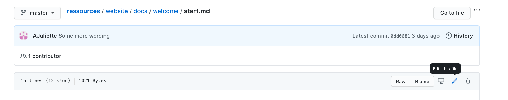

# Contribuer
Déjà, merci de considérer de contribuer au site Ressources de Women On Rails. C'est grâce à toi que le site reste pertinent pour tou.te.s ses utilisateur.rice.s !<br/>
Ce fichier a pour but de t'aider à faire en sorte que ta contribution (que ce soit ta première sur un repo en open source ou pas) se passe bien, pour toi comme pour les personnes qui gèrent le site !

# Ce qu'on attend comme contributions
C'est un site de ressources, donc il y a des contributions de contenu. On a: 
- les pages ressources où tu peux modifier / ajouter des pages ou même des catégories
- le blog où tu peux poster un article

Mais tu peux aussi contribuer autrement :
- sur toute la documentation du repository (le readme, ce fichier...) 
- la mise en page ou le design du site
- signaler un bug
- rajouter des outils sur le repo (un linter pour le MarkDown, une CI, une librairie cool pour les projets open-source...)

# Les règles pour contribuer
- Si tu veux ajouter une nouvelle page sur le site (autre qu'une page ressource ou blog) ou corriger un bug, commence par [créer une issue](https://github.com/women-on-rails/ressources/issues/new) pour qu'on valide ça ensemble.
- Women On Rails suit le code of conduct de [Ruby Monstas](http://coaching.rubymonstas.org/fr/), donc en communiquant avec l'ensemble de la communauté (les personnes gérants le repo, les personnes qui contribuent) tu dois respecter ces règles.
- Si tu contribues du contenu, il faut qu'il respecte ces règles également, sinon ta contribution sera refusée.
- Pour ce qui est de la production de contenu sur le site ou le blog, on fait attention à ce qu'il n'y ait pas de fautes, donc on te demandera de reprendre ton texte s'il y en a.
- Le site est ouvert à tout le monde et toute contribution respectant les règles est la bienvenue. Pour le blog, on n'accepte des articles que de femmes membres de Women On Rails, c'est un endroit réservé où faire entendre nos voix et être inspirée.

# Ta première contribution
Bon, maintenant, par où tu peux commencer ?<br/>
Tu peux déjà regarder s'il y a des issues ouvertes avec le label [good-first-issues](https://github.com/women-on-rails/ressources/issues?q=is%3Aopen+is%3Aissue+label%3A%22good+first+issue%22), qui sont facilement accessibles pour les débutant.e.s en open source, histoire de briser la glace en douceur !<br/>
Tu peux aussi [directement proposer une modification sur une des pages déjà en ligne](#contribuer-à-partir-du-site).<br/>

<details>
  <summary>
    <b>Et à part ça, on a (plein) d'idées de pages ressources à écrire !</b>
  </summary>
  <ul>
  <li>Ajouter une catégorie <b>Apprendre</b> avec les pages:</li>
    <ul>
      <li>pourquoi apprendre à coder</li>
      <li>pourquoi choisir Ruby on Rails</li>
      <li>comment se former (sites, formation...)</li>
    </ul>
  <li>Dans la catégorie <b>Trouver un job</b></li>
    <ul>
      <li>ajouter les pages suivantes:</li>
        <ul>
          <li>candidater (rédiger un CV / une lettre de motivation)</li>
          <li>le processus d'embauche (le déroulé du process: appel / test technique / retours, ce qu'attend les recruteurs d'un entretien / test)</li>
          <li>les questions à poser lors du recrutement</li>
          <li>après l'entretien (comment remercier / relancer)</li>
        </ul>
      <li>ajouter sur la page "Questions techniques" directement des questions en Ruby, Rails, SQL, Active Records, par niveau</li>
    </ul>
  <li>Dans la catégorie <b>Pratiquer</b>:</li>
    <ul>
      <li>rajouter une présentation de l'open source / petite historique sur la page concernée</li>
      <li>rajouter dans la page projets persos des exemples de projets sous RoR</li>
    </ul>
  <li>Dans la catégorie <b>Rejoindre la communauté</b>:</li>
    <ul>
      <li>Faire une page "Transmettre" avec: Écrire des articles (medium, dev.io); Rejoindre des réseaux solidaires (social builder); Participer à un talk (comment se préparer) => Tout ça peut éventuellement être une catégorie en soi</li>
    </ul>
  <li>Ajouter une catégorie <b>Visualuser l'écosystème RoR</b>:</li>
    <ul>
      <li>Trombinoscope avec profils twitter (DHH, Matz...)</li>
      <li>Recenser les entreprises qui codent en RoR par localisation avec des liens vers leurs pages présentant leur tech, leur équipe...</li>
    </ul>
  <li>Ajouter une catégorie <b>S'inspirer</b>:</li>
    <ul>
      <li>Page "Portraits de développeuses"</li>
    </ul>
  <li>Ajouter une catégorie <b>Au-delà de RoR</b>:</li>
    <ul>
      <li>Page "Les petits plus en entreprise" avec des ressources pour: command line, git, regex, sql, css / html, bootstrap, vanilla JS, comment se débugguer</li>
      <li>Ressources Front-End</li>
      <li>Resources Design</li>
      <li>Ressources Computer Science</li>
    </ul>
  <li>Ajouter une catégorie <b>Lexique</b> ?</li>
    <li>Page  "Termes techniques du site" ?</li>
    <li>Page "Jargon start-up" ?</li>
  </ul>
</details><br/>

## Ta toute première Pull Request
Si tu n'as jamais fait de Pull Request auparavant, tu peux [t'entraîner ici](https://github.com/firstcontributions/first-contributions).

# C'est parti !

## Comment contribuer du code ou du contenu

### Contribuer à partir du site
Si tu t'es déjà baladé.e sur le site, tu as pu voir qu'en bas de chaque page ressource il y a ce lien:<br/>


Si tu remarques que quelque chose ne va pas sur la page ou si tu veux y ajouter ta contribution:
1. Clique sur le lien `Edit this page`
2. GitHub te propose de forker le repo (c'est-à-dire copier une version du dossier sur ton compte)
3. Modifies le fichier directement en ligne
4. Retourne sur la page d'accueil de ce repo et fais une Pull Request

### Contribuer à partir d'un dossier local
Si tu préfères travailler de ton éditeur de texte, tu peux: 
1. Forker le repo
2. Le cloner sur ton ordinateur
3. [Installer le site](#Installer-le-site-en-local)
4. Créer une branche
5. Faire tes changements et commiter
6. Pusher
7. Retourner sur la page de ce repo
8. Faire une Pull Request

### Contribuer à partir de GitHub
Si tu es un plus aguerri.e (ou pressé.e) et que tes modifications ou ajout ne concernent qu'un seul fichier tu peux:
1. Forker le repo
2. Directement modifier ou ajouter des fichiers en ligne
3. Commiter
4. Retourner sur la page de ce repo
5. Faire une Pull Request

Modifier un fichier en cliquant sur le petit crayon en haut:

Ajouter un fichier:


## Installer le site en local
1. Vérifie que tu as [node](https://nodejs.org/en/download/) insallé et [yarn](https://classic.yarnpkg.com/fr/docs/install/#mac-stable).

2. Installe les dépendances:

```sh
$ yarn
```

3. Lance le serveur local:

```sh
$ yarn start
```

Cela va t'ouvrir une page `http://localhost:3000/`

## Quel format pour ta Pull Request

## Comment ajouter une issue
Tu peux contribuer aussi en signalant un bug ou en proposant une feature.

# Une présentation du repo histoire de s'y retrouver

Le site est construit en utilisant [la version 2 de Docusaurus](https://v2.docusaurus.io/), qui permet de mettre facilement en ligne de la documentation.<br/>
Il y a quelques pages en React (la page d'accueil, la page à propos), mais sinon les fichiers ressources et les pages de blog sont au format **MarkDown**, comme celui de tout README d'un repo.<br/>
Tu peux réviser la syntaxe Markdown en [60 secondes](https://commonmark.org/help/) ou [suivre un tutorial de 10 minutes](https://commonmark.org/help/tutorial/).


## Structure du dossier website
Tu trouves dans `website/blog` les articles et dans `website/docs` les pages du site dans des sous-dossiers.<br/>
Les fichiers images sont dans `website/src/assets/img` et tu peux ajouter du css custom dans `website/src/assets/css/custom.css`.<br/>
La barre de navigation sur le côté est dans le fichier `website/src/sidebar.js`.

```
website/
  docs/
    dossier/
      doc-1.md
      doc-2.md
      doc-3.md
  website/
    blog/
      2016-3-11-oldest-post.md
      2017-10-24-newest-post.md
    core/
    node_modules/
    pages/
    src/
      assets/
        css/
        img/
      sidebars.js
    package.json
    docusaurus.config.js
```

## Comment modifier ou ajouter un contenu

### Comment modifier du contenu

<details>
  <summary>
    Comment éditer une page doc existante
  </summary>
Tu peux modifier une page en te rendant dans le dossier website/docs et en modifiant le document que tu veux:

```markdown
/* Fichier website/docs/document-a-modifier.md */

---
id: document-à-modifier
title: Document à modifier
---

À modifier...
```

[Pour plus d'information sur les docs](https://docusaurus.io/docs/en/navigation).
</details>

<details>
  <summary>
    Comment éditer un article de blog existant
  </summary>
    Tu peux modifier une page en te rendant dans le dossier website/blog et en modifiant l'article que tu veux:

  ```markdown
  /* Fichier website/blog/article-a-modifier.md */

  ---
  id: article-a-modifier
  title: Article à modifier
  ---

  À modifier...
  ```

  [Pour plus d'information sur les articles de blog](https://docusaurus.io/docs/en/adding-blog).
</details><br/>

### Comment ajouter du contenu

<details>
  <summary>
    Ajouter une nouvelle page doc
  </summary>
   
1. Ajoute un nouveau document au format markdown dans le dossier website/docs, comme par exemple:

```md
/* Fichier website/docs/nouveau-doc.md */

---
id: nouveau-doc
title: Nouveau doc
---

Nouveau contenu.
Nouvelle vie.
```

2. Rajoute l'ID de ce doc dans le fichier de la barre de navigation, soit en l'ajoutant directement dans une catégorie existante (ici: Bienvenue): 

```javascript
/* Fichier website/src/sidebars.js */

{
  "docs": {
    "Bienvenue": [
      "start",
      "nouveau-doc" // ajoute ton doc ici
    ],
    ...
  },
  ...
}
```

3. Tu peux aussi créer ta propre catégorie sous le format:

```javascript
{
  "docs": {
    "Nouvelle catégorie": [
      "nouveau-doc"
    ],
    ...
  },
  ...
}
```

[Pour plus d'information sur comment ajouter un doc](https://docusaurus.io/docs/en/navigation).

</details>
<details>
  <summary>
    Ajouter un nouvel article de blog
  </summary>
Ajoute un article avec le format 

```
YYYY-MM-DD-Le-Titre-De-Mon-Article.md
```
dans website/blog:

  ```markdown
  /* Fichier website/blog/2020-10-03-It-s-October-Third.md */
  ---
  author: Foo Bar
  authorURL: https://twitter.com/foobarbaz
  authorFBID: 503283835
  title: It's October Third
  ---

  Lorem Ipsum...
  ```

  L'aperçu de l'article doit se situer au-dessus de la ligne `truncate`

  ```markdown
  // Haut de l'article
    <!--truncate-->
  // Suite de l'article
  ```

  [Pour plus d'information sur comment ajouter un article](https://docusaurus.io/docs/en/adding-blog).
</details><br/>

### Ajouter d'autres éléments
<details>
  <summary>
    Ajouter des éléments à la barre de navigation du haut
  </summary>
  Tu peux ajouter des liens vers les documents, des pages customs ou vers des sites externes en modifiant la clé headerLinks du fichier website/docusaurus.config.js:

  ```javascript
  /* Fichier website/docusaurus.config.js */

  {
    headerLinks: [
      ...
      /* ajouter un doc */
      { doc: 'exemples', label: 'Exemples' },
      /* ajouter une page custom */
      { page: 'Aide', label: 'Aide' },
      /* ajouter un site externe */
      { href: 'https://github.com/facebook/docusaurus', label: 'GitHub' },
      ...
    ],
    ...
  }
  ```

  [Pour plus d'information sur la barre de navigation du haut](https://docusaurus.io/docs/en/navigation).
</details>
<details>
  <summary>
    Ajouter une page custom
  </summary>
  Docusaurus utilise les React components pour construire des pages. Les pages sont sauvegardés au format .js dans website/src/pages.

  [Pour plus d'information sur les pages custom](https://docusaurus.io/docs/en/custom-pages).
</details><br/>

## La documentation officielle de Docusaurus
Docusaurus a une [documentation très détaillée](https://v2.docusaurus.io/docs/2.0.0-alpha.65/) pour tout ce qui est création de page, ajout de style... N'hésite pas à t'y référer, en particulier la section [Guides](https://v2.docusaurus.io/docs/2.0.0-alpha.65/creating-pages).<br/>
Pour le style des pages custom, Docusaurus utilise [Infima](https://facebookincubator.github.io/infima/docs/getting-started/introduction).

# Code review
Pfiouuu, ça y est, tu as fais une Pull Request, [maintenant qu'est-ce qu'il va se passer ?](https://media3.giphy.com/media/NixlSwT0iyFzi/giphy.gif)<br/>
Tu as normalement une réponse dans les 48 heures, si ce n'est pas le cas, tu peux taguer dans la Pull Request: `@AJuliette` (pour l'instant seule mainteneuse du repo !).<br/>
Le déploiement est actuellement manuel, il est fait après chaque Pull Request mergée, donc tu verras tes changements rapidement !

# Les derniers petits trucs

## Les noms de branche
Tu peux reprendre soit le nom de l'issue que tu traites. Par exemple pour mettre à jour la doc pour l'open source j'ai une branche `prepare-repo-for-contributions`.<br/>
Si tu ajoutes une page ou un article ça peut être: `add-page-nom-de-la-page` / `add-blog-post-nom-ou-sujet-de-l'article`.<br/>
Même chose si tu modifies une ressource: `update-page-nom-de-la-page` / `update-blog-post-nom-ou-sujet-de-l'article`.

## Les messages de commit
Fais comme tu as l'habitude.

## La labelisation des issues
- Pour les issues simples: `good first issue`.
- Pour celles qui ont besoin d'être redéfinies et d'aide dans la conception: `pending`.
- Pour les bug fixes: `bug`.
