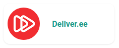
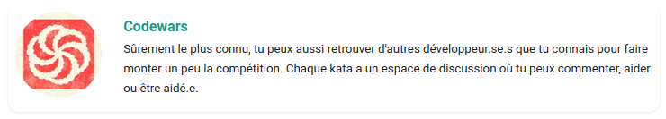

# Les Components

## Qu'est-ce qu'un component ?

Un `component` en ReactJS est un morceau de code réutilisable. Il va nous servir à afficher des éléments tels que des `cards` ou `avatars` avec tout le `markup` nécessaire.
On utilise la syntaxe `JSX`, très semblable à `javascript`.

:arrow_forward: Une petite [Introduction à JSX](https://fr.reactjs.org/docs/introducing-jsx.html)  
:arrow_forward: Plus d'infos sur les composants de React sur la doc officielle : [Components and props](https://fr.reactjs.org/docs/components-and-props.html)

Docusaurus (le framework faisant tourner ce site) est réalisé en React et de ce fait nous pouvons utiliser des composants dans les fichiers ressources `.mdx` et bien sûr `.js`.

Le format `.mdx` va nous permettre d'utiliser à la fois du `markdown` et du `JSX` pour écrire nos articles. Ceux-ci seront plus agréables à lire et plus faciles à éditer.
Pour en savoir plus sur le format `.mdx`, tu peux te référer à la [doc](https://v2.docusaurus.io/docs/markdown-features/#embedding-react-components-with-mdx).

## Comment les utiliser

Pour te servir d'un component, il faut:
- que le fichier où tu veux l'importer soit au format `.mdx` (il peut être bien sûr au format `.js` si c'est une page autre que ressource)
- importer le component voulu en haut de ton fichier, comme ça: `import TonComponent from '@site/src/components/ton_component.js';`
- lui passer les attributs nécessaires

## Les components de base de Docusaurus

Pour créer des liens internes, Docusaurus dispose d'un component bien utile : le component `<Link />`, il va précharger les liens, pour que les pages s'affichent plus rapidement.

Pour l'utiliser : 
1. Importe le component en haut de ton fichier `.mdx` ou `.js` : `import Link from '@docusaurus/Link';`
2. Puis dans ta page : `<Link to="questions-techniques">questions techniques</Link>`, pour l'attribut `to` c'est le `slug` de l'article (on le trouve en haut de la page cible : `slug: /questions-techniques`)

Docusaurus dispose de quelques autres components de base :

* `<Head/>`
* `<Redirect/>`
* `<BrowserOnly/>`

:arrow_forward: Pour leur usage, tu pourras trouver de la documentation [sur la doc de Docusaurus](https://v2.docusaurus.io/docs/docusaurus-core#components)

## Liste des components ajoutés

Nous avons ajouté des components au site au fur et à mesure de nos besoins, ils se trouvent dans le dossier `website/src/components/`

* `<Avatar/>` : [website/src/components/avatar.js](website/src/components/avatar.js)
* `<BlogCard/>` : [website/src/components/blog_card.js](website/src/components/blog_card.js)
* `<DarkModeImage/>` : [website/src/components/dark_mode_image.js](website/src/components/dark_mode_image.js)
* `<HorizontalCard/>` : [website/src/components/horizontal_card.js](website/src/components/horizontal_card.js)
* `<Timeline/>` et `<TimelineStep/>` : [website/src/components/timeline.js](website/src/components/timeline.js) et [website/src/components/timeline_step.js](website/src/components/timeline_step.js)


<details>
  <summary>
    Avatar
  </summary>

<br/>

**Chemin d'accès** : [website/src/components/avatar.js](website/src/components/avatar.js)

**Description** : utilisé sur la page [S'entraîner aux tests](https://women-on-rails.github.io/ressources/docs/s-entrainer-aux-tests), il permet d'afficher une petite card avec un logo, un titre, et un lien : 



**Utilisation**

1. Importation en haut du fichier : `import Avatar from '@site/src/components/avatar.js';`
2. Exemple :

```jsx
<Avatar 
  src='/img/find_a_job/katas/deliver_ee.png'
  alt='Logo Deliver.ee'
  href='https://github.com/deliver-ee/challenges'
  title='Deliver.ee'
/>
```
</details>

<details>
  <summary>
    BlogCard
  </summary>

<br/>

**Chemin d'accès** : [website/src/components/blog_card.js](website/src/components/blog_card.js)

**Description** : utilisé sur la [page d'accueil du blog](https://women-on-rails.github.io/ressources/blog), il permet d'afficher une carte comprenant diverses informations : 


**Utilisation**

1. Importation en haut du fichier : `import BlogCard from '@site/src/components/blog_card.js';`
2. Exemple :

```jsx
<BlogCard
  link={
    "https://women-on-rails.github.io/ressources/blog/2020/10/18/update-contributing"
  }
  image={useBaseUrl("img/blog/article2.png")}
  imageAlt={"Mise à jour de la doc"}
  imageTitle={"Mise à jour de la doc"}
  title={"Mise à jour de la doc"}
  summary={
    "Le site profite de l'Hacktoberfest pour avoir ses premières contributions, vous trouverez ici toutes les informations pour contribuer !"
  }
  date={"18 octobre 2020"}
  author={"Juliette"}
  tag={"OPENSOURCE"}
/></BlogCard>
```
</details>

<details>
  <summary>
    DarkModeImage
  </summary>

<br/>

**Chemin d'accès** : [website/src/components/dark_mode_image.js](website/src/components/dark_mode_image.js)

**Description** : utilisé sur la page [À propos](https://women-on-rails.github.io/ressources/help), il permet d'utiliser une image différente pour le mode dark (ou inversement) si l'image est trop peu lisible dans ce mode, il te faudra donc 2 images : 


**Utilisation**

1. Importation en haut du fichier : `import DarkModeImage from '@site/src/components/dark_mode_image.js';`
2. Exemple :

```jsx
<DarkModeImage 
  imgsrcdark="/img/slack_dark.png"
  imgsrclight="/img/slack.png"
  customclass="social-logo"
/>
```
</details>

<details>
  <summary>
    HorizontalCard
  </summary>

<br/>

**Chemin d'accès** : [website/src/components/horizontal_card.js](website/src/components/horizontal_card.js)

**Description** : utilisé sur la page [S'entraîner aux tests](https://women-on-rails.github.io/ressources/docs/s-entrainer-aux-tests), il permet d'afficher une carte horizontale comprenant une image, un lien, et une petite description: 



**Utilisation**

1. Importation en haut du fichier : `import HorizontalCard from '@site/src/components/horizontal_card.js';`
2. Exemple :

```jsx
  <HorizontalCard
    src='/img/find_a_job/katas/codewars.jpeg'
    alt='Logo Codewars'
    href='https://www.codewars.com/'
    title='Codewars'
    description="Sûrement le plus connu, tu peux aussi retrouver d'autres développeur.se.s que tu connais pour faire monter un peu la compétition. Chaque kata a un espace de discussion où tu peux commenter, aider ou être aidé.e."
  />
```
</details>

<details>
  <summary>
    Timeline et TimelineStep
  </summary>

<br/>

**Chemin d'accès** : [website/src/components/timeline.js](website/src/components/timeline.js) et [website/src/components/timeline_step.js](website/src/components/timeline_step.js)


**Description** : ces deux components sont à utiliser ensemble, on peut les voir sur la page [Le processus d'embauche](https://women-on-rails.github.io/ressources/docs/le-processus-d-embauche), il permettent de présenter une marche à suivre ou un processus avec des étapes : 


**Utilisation**

1. Il te faudra importer 2 fichiers :
```jsx
import Timeline from '@site/src/components/timeline.js';
import TimelineStep from '@site/src/components/timeline_step.js';
```
2. Exemple :
Ici tu ne vas remplir que le titre dans les attributs du component `TimelineStep`, le contenu des étapes est à remplir entre les balises `<TimelineStep>` et `</TimelineStep>`, tu pourras ainsi inclure des liens ou tout d'autres éléments html. La numérotation se fait automatiquement grâce au CSS inclus dans la feuille de style [timeline](website/src/css/timeline.module.css).

```jsx
<Timeline>
  <TimelineStep title="L'entretien">
    Qu'il soit téléphonique, en visio-conférence ou face à face, c'est la première étape, l'occasion de faire connaissance avec le premier interlocuteur de la société. Au delà du bien connu "Racontez moi votre parcours", on pourra aussi te poser des <Link to="questions-techniques">questions techniques</Link>.
  </TimelineStep>

  <TimelineStep title="Le ou les tests techniques">
    La première étape passée, il faudra certainement faire un ou plusieurs tests techniques, mais pas de panique ! On a quelques ressources pour t'aider dans cette tâche qui est une magnifique occasion de s'améliorer et d'avoir des retours de ce qu'attendent les entreprises&nbsp;: <br />
    ➡️ <Link to="les-types-de-tests-techniques">Les différents types de tests techniques</Link><br />
    ➡️ <Link to="s-entrainer-aux-tests">S'entraîner aux tests</Link>
  </TimelineStep>
</Timeline>
```
</details>


## Créer un Component

  Si tu créées un élément que tu penses seras utile à d'autres endroits du site, tu peux en faire un component qui sera utilisable par d'autres !<br/>
  Les components sont au format JSX. On te conseille ce [tuto de React](https://fr.reactjs.org/docs/introducing-jsx.html) pour le découvrir.<br/>
  Tu peux t'inspirer de components présents déjà assez simples comme celui pour les [avatars](https://github.com/women-on-rails/ressources/blob/master/website/src/components/avatar.js).</br>
:bulb: Petit tip: n'oublie pas `import React from 'react';` au début du fichier.
</details>

Pour en savoir plus sur le format `.mdx`, tu peux te référer à la [doc](https://v2.docusaurus.io/docs/markdown-features/#embedding-react-components-with-mdx).

### CSS modules

Pour styler tes components, tu peux utiliser une feuille de style dédiée exclusivement à ton component (elle ne se chargera que si le component est appelé !).
Pour ce faire :
1. dans le dossier `website/src/css/`, nomme ta feuille de style avec `.module.css` à la fin (exemple : `toncomponent.module.css`)
2. Importe-la en haut de ton fichier : `import styles from toncomponent.module.css`
3. Tu peux aussi n'importer que les classes dont tu as besoin : `import { timeline } from '@site/src/css/toncomponent.module.css';`
4. Pour l'utiliser dans ton code : `<div className={ styles.step }>`, si tu n'as importé que les classes dont tu avais besoin : `<div className={ timeline }>`

:arrow_forward: Pour plus d'infos sur les modules CSS, voici la [doc officielle](https://v2.docusaurus.io/docs/styling-layout/#css-modules).
